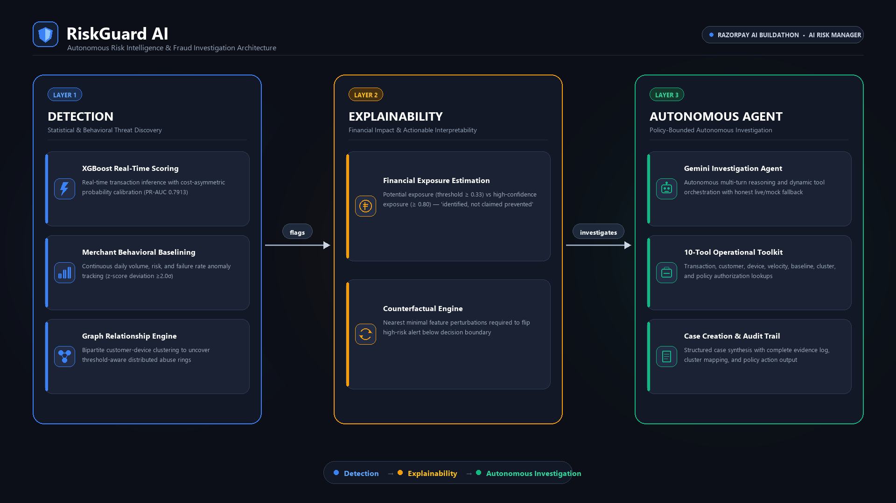
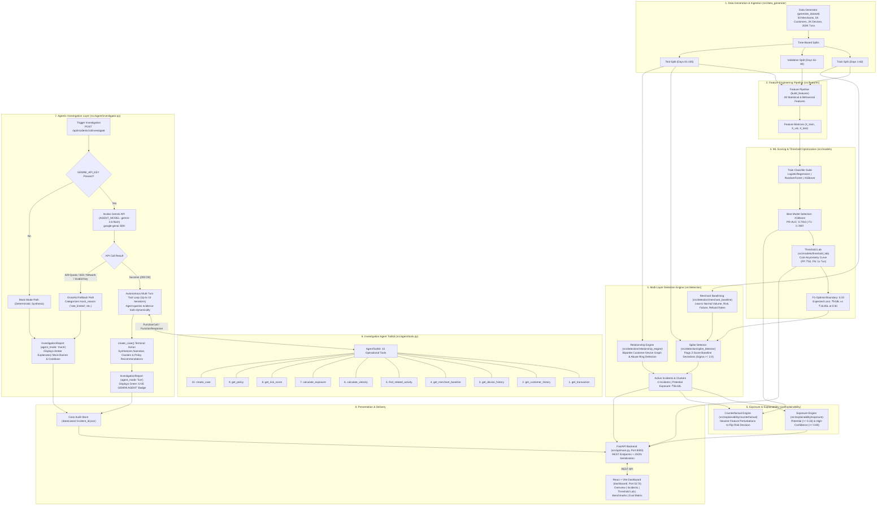

# RiskGuard AI

**Agentic Early-Warning and Investigation System for Emerging Merchant Fraud**  
*Built for the Razorpay AI Buildathon — "AI Risk Manager" Track*

---

## Problem Statement

Emerging merchant fraud on digital payment platforms rarely presents as obvious, high-velocity attacks. Sophisticated fraud syndicates intentionally operate across distributed networks of compromised devices, execute small transaction amounts calibrated just below naive velocity thresholds, and coordinate across multiple merchant accounts to evade traditional rule engines.

**RiskGuard AI** is a defense-only risk intelligence platform that bridges the gap between raw statistical ML detection and operational risk action. It pairs real-time gradient-boosted transaction scoring with continuous merchant behavioral baselining, graph-based abuse ring detection, and an autonomous LLM investigation agent. Rather than producing opaque numeric alerts, RiskGuard autonomously gathers multi-source evidence, traces cross-merchant fraud clusters, evaluates policy-bounded interventions, and drafts audited investigation cases.

---

## Architecture Diagram



The system architecture spans eight functional stages—from synthetic generation and feature engineering to multi-layer detection, autonomous agent reasoning, and interactive visualization:



---

## Key Features

- **Multi-Layer Detection Stack**: Combines XGBoost supervised machine learning with merchant behavioral baseline tracking ($\ge 2.0\sigma$ volume/failure z-score deviations) and bipartite customer-device graph community detection.
- **Adversarial Robustness**: Evaluated against 4 distinct merchant scenarios. Successfully catches **93.8%** of stealthy "slow fraud rings" that bypass conventional velocity rules entirely (0.0% detection by naive rules), cutting missed exposure from ₹41.03L down to ₹2.66L.
- **Counterfactual Explanations**: For every flagged incident, generates minimal actionable perturbations (e.g. required reduction in 1-hour velocity or 3DS verification) necessary to transition the transaction below the risk threshold.
- **Financial Exposure Estimation ("Identified, Not Claimed Prevented")**: Rigorously categorizes exposure into *Potential Exposure* (cumulative value of all flagged transactions at threshold 0.33) and *High-Confidence Exposure* (transactions with risk score $\ge 0.80$), avoiding misleading claims of guaranteed prevented fraud.
- **Cost-of-Inaction Benchmark**: Models real financial trade-offs between false-positive merchant friction (₹50/review) and false-negative fraud leakage (1.0x transaction value + ₹25 chargeback fee). Proves a **94.3% loss reduction** (₹3.03L total loss vs ₹53.34L unmitigated).
- **Interactive Threshold Lab**: Implements a cost-asymmetric decision boundary locked to **0.33**, demonstrating that cutting the threshold below 0.50 prevents an additional 234 fraudulent transactions and saves ₹7.27L in net loss.
- **Drift & Re-baselining Simulation**: 20-day timeline simulation illustrating post-incident recovery across 3 phases: *Critical Freeze* (Days 1–5), *Validation Monitoring* (Days 6–10), and *Gradual Re-baselining* (Days 11–20).
- **Autonomous Agentic Investigation**: Powered by the Gemini API via standard function-calling, the agent executes up to 10 autonomous reasoning cycles across 10 purpose-built tools, correlating transaction metadata, velocity windows, graph clusters, and policy constraints.
- **Dual-Path Architecture with Graceful Fallback**: Transparently transitions to deterministic mock mode if the external LLM API is unavailable, rate-limited (HTTP 429), or missing credentials, clearly labeling mock mode in the UI.

---

## Tech Stack

| Layer | Technologies | Description |
| :--- | :--- | :--- |
| **Backend & ML** | Python 3.10+, FastAPI, Uvicorn, scikit-learn, XGBoost, NetworkX, Pandas, NumPy, Joblib | End-to-end data pipeline, feature extraction, graph clustering, ML training, and REST API. |
| **Agent & LLM** | Google Gemini API (`google-genai` SDK), `src/config.py:AGENT_MODEL` | Pinned to `gemini-3.6-flash` (or available runtime model), function-calling tool loop, policy enforcement. |
| **Frontend** | React 18, Vite, Recharts, Vanilla CSS | Dark-mode glassmorphic interface with reactive state, SVG charting, and live tool audit trail. |
| **Data & Storage** | Parquet, JSON, Joblib serialization | Local file-based caching and state persistence under `data/` and `src/models/saved/`. |

---

## Live vs. Mock Mode

RiskGuard AI is designed with an **honest, production-minded fallback architecture**:

1. **Pre-computed Offline Pipeline**: The machine learning models, feature matrices, merchant baselines, relationship graph clusters, and financial exposures are pre-computed during pipeline execution and served directly by FastAPI.
2. **Genuinely Live Agent**: When an analyst clicks **"Investigate Incident"** in the dashboard, the backend triggers `investigate_incident()`. If `GEMINI_API_KEY` is present, it connects live to the Gemini API, engages in a dynamic multi-turn tool-calling loop (querying transactions, customer records, and fraud clusters), and synthesizes a fresh investigation report.
3. **Transparent Mock Fallback**: If no API key is provided, or if the free-tier API rate limit is exceeded (HTTP 429 / `RESOURCE_EXHAUSTED` / 503 high demand), the system gracefully degrades to deterministic mock synthesis rather than crashing:
   - **Live Mode**: Displays a bright green **`LIVE GEMINI AGENT`** badge alongside the model name and the exact tool execution audit trail.
   - **Mock Mode**: Displays an amber **`MOCK MODE`** banner detailing the exact reason (`rate_limited`, `invalid_key`, or `no_api_key`).
   - **Cooldown Protection**: A 20-second client-side cooldown timer prevents accidental rapid-fire exhaustion of free-tier API quotas.

---

## Evaluation Results

All metrics below are extracted directly from the persistent pipeline artifacts in [`src/models/saved/`](file:///c:/Users/HP/OneDrive/المستندات/Razorpay/RiskGuard/src/models/saved/).

### 1. ML Model Performance (Held-Out Test Set)

*Source: [`evaluation_matrix.json`](file:///c:/Users/HP/OneDrive/المستندات/Razorpay/RiskGuard/src/models/saved/evaluation_matrix.json) & [`model_comparison.json`](file:///c:/Users/HP/OneDrive/المستندات/Razorpay/RiskGuard/src/models/saved/model_comparison.json)*

| Metric | Logistic Regression | Random Forest | XGBoost (Selected) |
| :--- | :---: | :---: | :---: |
| **PR-AUC** | 0.8374 | 0.9064 | **0.7913** |
| **Precision** | 0.0238 | 0.0000 | **0.8183** (81.8%) |
| **Recall** | 0.9830 | 0.0000 | **0.7631** (76.3%) |
| **F1 Score** | 0.0465 | 0.0000 | **0.7897** (79.0%) |

> **Selection Rationale**: While uncalibrated tree ensembles exhibited extreme precision/recall skew on this imbalanced dataset (Random Forest collapsed to zero predictions at standard threshold; Logistic Regression flagged nearly everything), XGBoost delivered the strongest balanced discrimination, achieving an F1 score of **0.7897** and PR-AUC of **0.7913**.

### 2. Threshold Lab: Cost Asymmetry Optimization

*Source: [`threshold_curve.json`](file:///c:/Users/HP/OneDrive/المستندات/Razorpay/RiskGuard/src/models/saved/threshold_curve.json)*

| Threshold | Precision | Recall | F1 Score | False Positives | False Negatives | Expected Financial Loss |
| :---: | :---: | :---: | :---: | :---: | :---: | :---: |
| **0.33 (RiskGuard Default)** | **79.4%** | **86.5%** | **82.8%** | **520** | **312** | **₹9,58,403.37** |
| 0.50 (Standard) | 81.8% | 76.4% | 79.0% | 392 | 546 | ₹16,85,109.71 |
| **Impact ($\Delta$)** | -2.4% | **+10.1%** | **+3.8%** | +128 reviews | **-234 missed frauds** | **-₹7,26,706.34 (-43.1%)** |

> **Cost Asymmetry Rationale**: In payment systems, a missed fraud transaction costs the full transaction amount plus chargeback fees (avg ~₹1,500–₹5,000+), whereas reviewing a false positive costs ~₹50. Setting the operating boundary to **0.33** accepts 128 additional manual reviews in exchange for preventing 234 additional fraudulent payments, cutting financial loss by **43.1%**.

### 3. Adversarial Robustness Benchmark

*Source: [`adversarial_results.json`](file:///c:/Users/HP/OneDrive/المستندات/Razorpay/RiskGuard/src/models/saved/adversarial_results.json)*

| Scenario Type | Naive Velocity Rule Detection | RiskGuard AI Detection | Scenario Description |
| :--- | :---: | :---: | :--- |
| **Normal Behavior** | 0.0% | 0.0% | Clean baseline merchant traffic |
| **Fraud Spike** | 100.0% | 100.0% | Obvious burst velocity spike |
| **Slow Fraud Ring** | **0.0%** | **93.8%** | Threshold-aware coordinated syndicates |
| **Flash Sale** | 0.0% | 0.0% | Legitimate promotional volume burst |
| **False Positive Rate** | **0.00%** | **0.56%** | Across 123.2K evaluation transactions |
| **Exposure Missed** | **₹41,02,781.83** | **₹2,65,524.89** | **93.5% reduction in missed exposure** |

### 4. Cost-of-Inaction Financial Comparison

*Source: [`cost_of_inaction.json`](file:///c:/Users/HP/OneDrive/المستندات/Razorpay/RiskGuard/src/models/saved/cost_of_inaction.json)*

| Policy / System | Total Financial Loss | Review Cost (FP) | Fraud Leakage (FN) | Fraud Caught (%) | Net Savings vs No System |
| :--- | :---: | :---: | :---: | :---: | :---: |
| **No System** | ₹53,34,018.34 | ₹0.00 | ₹53,34,018.34 | 0.0% | Baseline |
| **Static Rules** | ₹41,52,356.83 | ₹50.00 | ₹41,52,306.83 | 14.4% | ₹11.82L (22.2%) |
| **RiskGuard AI** | **₹3,02,624.89** | **₹34,050.00** | **₹2,68,574.89** | **94.7%** | **₹50.31L (94.3%)** |

### 5. Measured System Latency & Operational Throughput

*Source: [`latency_results.json`](file:///c:/Users/HP/OneDrive/المستندات/Razorpay/RiskGuard/src/models/saved/latency_results.json)*

- **ML Inference Latency**: **2.19 ms** (batch of 1,000 transactions)
- **ML Scoring Throughput**: **456,517 events/second**
- **Autonomous Agent Investigation**: **12,845 ms** (~12.8s wall-clock for 4 LLM roundtrips and 23 function-calling tool executions)
- **End-to-End System Latency**: **12,847.2 ms**

---

## Known Limitations

1. **Synthetic Benchmark Dataset**: RiskGuard is trained and evaluated on synthetic data modeled after payment aggregator traffic patterns (50 merchants, 5,000 customers, 2,000 devices, 200,000 transactions across 100 days). While realistic, it does not represent live Razorpay proprietary production data.
2. **LLM Free-Tier API Rate Limits**: Under Google AI Studio's free tier, models enforce strict requests-per-day quotas (e.g. 20 requests/day per GCP project for certain preview models) and short-window rate limits. Running multiple live investigations in rapid succession triggers the rate-limit fallback. The platform handles this gracefully via cooldowns and mock mode.
3. **The Flash-Sale Hard-Failure Case**:
   - *Behavior*: A legitimate promotional event creates an abrupt volume spike that mathematically mirrors a fraud spike in volume and velocity features.
   - *System Finding*: The relationship engine correctly avoids flagging it as a fraud cluster (no shared devices or coordinated card testing), but ML velocity metrics fire initial anomaly alerts.
   - *Mitigation*: The system hedges its alerts as medium-confidence. In production, this requires an external merchant promotional calendar integration to suppress false alerts during scheduled sales.

---

## Setup & Run Instructions

### Prerequisites
- **Python 3.10+**
- **Node.js 18+** and `npm`
- (Optional) **Google Gemini API Key** from [Google AI Studio](https://aistudio.google.com/)

### Step 1: Clone and Install Python Dependencies
```bash
# Clone the repository
git clone https://github.com/your-org/RiskGuard.git
cd RiskGuard

# Create and activate a virtual environment
python -m venv venv
# On Windows:
.\venv\Scripts\activate
# On Linux/macOS:
source venv/bin/activate

# Install required Python packages
pip install -r requirements.txt
```

### Step 2: Install Dashboard Dependencies
```bash
cd dashboard
npm install
cd ..
```

### Step 3: Configure Environment Variables
Create a `.env` file in the project root:
```ini
# .env
GEMINI_API_KEY=your_google_ai_studio_api_key_here
```
*(If no API key is provided, the platform runs automatically in Mock Mode with full functionality).*

### Step 4: Run the End-to-End Pipeline
Generate the dataset, train models, compute baselines, and produce all benchmarks:
```bash
python scripts/run_pipeline.py
```
*Outputs are saved to `data/` and `src/models/saved/`.*

### Step 5: Start the Backend & Frontend Servers
Open two terminal windows:

**Terminal 1 — Backend (FastAPI):**
```bash
python -m uvicorn src.api.main:app --host 127.0.0.1 --port 8000
```
- API Health Check: [http://127.0.0.1:8000/api/health](http://127.0.0.1:8000/api/health)
- Swagger Documentation: [http://127.0.0.1:8000/docs](http://127.0.0.1:8000/docs)

**Terminal 2 — Frontend (React / Vite):**
```bash
cd dashboard
npm run dev
```
- Web Dashboard: [http://127.0.0.1:5173/](http://127.0.0.1:5173/)

---

## Project Structure

```text
RiskGuard/
├── .env                              # Environment variables (GEMINI_API_KEY)
├── requirements.txt                  # Python dependencies
├── data/                             # Generated raw data, splits, and persisted cases
│   ├── cases/                        # Persisted investigation audit cases (JSON)
│   ├── raw/                          # Raw transaction, merchant, and entity records
│   └── splits/                       # Train (60d), val (20d), and test (20d) partitions
├── dashboard/                        # React + Vite frontend dashboard
│   ├── index.html                    # Single-page application entry
│   ├── package.json                  # Node dependencies & Vite scripts
│   └── src/
│       ├── App.jsx                   # Main application with tab routing & Recharts
│       ├── index.css                 # Dark-mode design system & typography
│       └── api/client.js             # REST client communicating with FastAPI
├── scripts/
│   ├── run_pipeline.py               # Complete end-to-end data/ML/benchmark pipeline
│   └── measure_and_verify.py         # Live investigation latency measurement script
└── src/
    ├── config.py                     # Central configuration, constants, model pins
    ├── schemas.py                    # Pydantic / Dataclass domain schemas
    ├── agent/                        # Autonomous investigation agent layer
    │   ├── investigator.py           # Multi-turn Gemini function-calling & mock fallback
    │   ├── tools.py                  # 10 structured tools available to the agent
    │   ├── policy.py                 # Policy action bounding & authorization checks
    │   └── audit.py                  # Audit record formatting & case creation
    ├── api/
    │   └── main.py                   # FastAPI application & REST endpoint definitions
    ├── benchmarks/                   # Benchmark suites
    │   ├── cost_of_inaction.py       # Financial loss vs static rules simulation
    │   ├── drift_rebaseline.py       # Post-incident drift timeline simulation
    │   └── latency_throughput.py     # Real-time inference benchmarking
    ├── data_generator/               # Synthetic payment traffic & fraud scenario generator
    ├── detection/                    # Core multi-layer detection engines
    │   ├── merchant_baseline.py      # Statistical volume/risk/failure baselining
    │   ├── spike_detector.py         # Z-score deviation incident generator
    │   ├── relationship_engine.py    # Bipartite customer-device graph clustering
    │   └── adversarial_demo.py       # Comparison harness against naive rules
    ├── explainability/               # Interpretability engines
    │   ├── counterfactual.py         # Minimal feature perturbation generator
    │   └── exposure.py               # Potential vs high-confidence exposure engine
    └── models/                       # Model training and optimization
        ├── train.py                  # Classifier training (LR, RF, XGBoost)
        ├── threshold_lab.py          # Cost-asymmetric decision boundary sweep
        └── saved/                    # Serialized models and benchmark JSON artifacts
```

---

## Buildathon Context

This project was built for the **Razorpay AI Buildathon** under the **"AI Risk Manager"** track, focusing on autonomous detection, explainability, and intelligent investigation of emerging merchant fraud.
